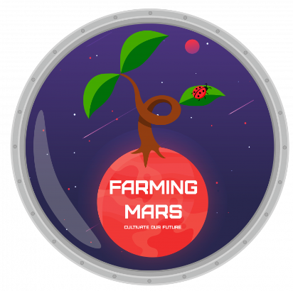
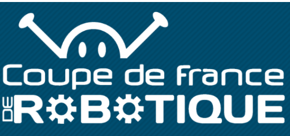

# Introduction
Au cours de l'année académique 2023-2024, dans le cadre de notre formation en Génie Energétique et Systèmes Numériques à Unilasalle Amiens, notre équipe s'est lancée un objectif passionnant : participer à la Coupe de France Robotique. Ce projet a été amorcé dans le cadre du cours de robotique mobile de deuxième année, avec pour ambition de concevoir un robot autonome répondant aux normes rigoureuses du comité organisateur de la compétition. Notre équipe, composée de DIMANCHE Alex, GEORGES Kilyan, GUICHARD Robin, JANEL Jean, JOLY Quentin, LASFER Amine et LELEU Clémence, a entrepris ce défi avec détermination, dans le but ultime de développer des robots capable d'apprendre de manière autonome.

Ce rapport est dédié à présenter en détail les diverses étapes que nous avons parcourues au cours de ce projet. Nous dévoilerons les sujets que nous avons étudiés, les objectifs que nous nous sommes fixés, ainsi que les méthodes que nous avons employées pour mener à bien ce projet ambitieux. De plus, nous vous offrirons un aperçu de la stratégie globale que nous avons élaborée pour relever les défis inhérents à cette compétition exigeante.

À travers ce document, nous souhaitons partager notre expérience, nos réussites et nos défis rencontrés tout au long de ce parcours enrichissant. En résumé, nous vous présenterons une vue d'ensemble exhaustive de notre démarche méthodique dans la conception et la réalisation de nos robots autonomes pour la  Coupe de France Robotique .

# Contexte du Projet

OBJECTIFS

1. Conception d'un robot autonome : Le projet vise à créer un robot capable de fonctionner de manière autonome, en relevant les défis spécifiques de la compétition "Coupe de France Robotique". Cela implique la résolution de problèmes liés à la navigation, à la détection d'obstacles et à la prise de décision autonome.

2. Conformité aux normes de la compétition : Le robot doit répondre aux exigences définies par le comité organisateur de la compétition. Cela inclut la conformité aux règles de dimensionnement, de sécurité et de performance établies par la "Coupe de France Robotique".

3. Intégration de capacités d'apprentissage autonome : Un aspect clé du projet est d'implémenter des mécanismes d'apprentissage autonome dans le robot. Ceci permettra au robot d'acquérir de nouvelles compétences et de s'adapter aux conditions changeantes de son environnement.

4. Gestion méthodique du projet : Le rapport met en lumière les différentes étapes méthodiques suivies par l'équipe pour mener à bien le projet. Cela inclut la planification, la conception, le développement, les tests et les ajustements nécessaires.

5. Stratégie de résolution de problèmes : Le document présente également une vue d'ensemble de la stratégie adoptée par l'équipe pour aborder les défis spécifiques liés à la compétition "Coupe de France Robotique". Cela englobe la prise de décision collective, la répartition des tâches et l'adaptation aux imprévus.

# Coupe de France de robotique "Farming Mars"

 | 

La Coupe de France de Robotique est une compétition dynamique où les équipes d'ingénieurs rivalisent pour concevoir et programmer des robots autonomes capables d'exécuter une série de tâches complexes.

Chaque match oppose deux équipes qui ont trois minutes pour préparer leurs robots avant un affrontement de 100 secondes. Pendant ce temps, les robots doivent accomplir différentes actions telles que rempoter des plantes, orienter des panneaux solaires pour maintenir l'énergie de la serre, assurer la pollinisation des plantes et retourner se recharger les batteries.

Le thème de cette année, "La Culture sur Mars", met l'accent sur l'importance de l'autonomie et de la durabilité dans des environnements extraterrestres. Les équipes doivent également respecter des règles strictes, notamment en évitant les interventions humaines pendant le match.

De plus, il est précisé dans le règlement qu’en plus du robot principal, des PAMI (Petit Automate Robotisé Indépendant) auront la charge de “pollinisateur” et donc seront tout aussi importants que notre robot principal pour obtenir de précieux points.

Nous avons pu obtenir toutes ces informations par [le règlement officiel de la coupe](https://www.coupederobotique.fr/wp-content/uploads/Eurobot2024_Rules_CUP_FR_FINAL.pdf).

# Pièces du RATP
Ci-après, la liste des pièces qui composent le [projet RATP](http://unimakers.fr/CDR-2024-I2-RATP/). L'électronique ne sera pas détaillée ici.