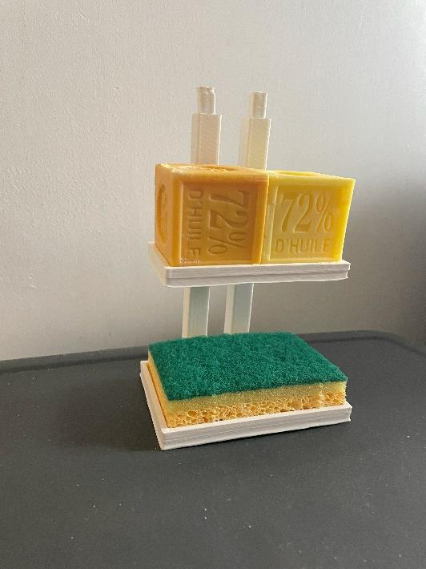
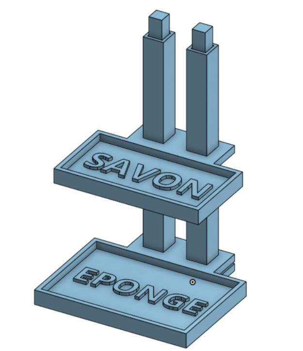
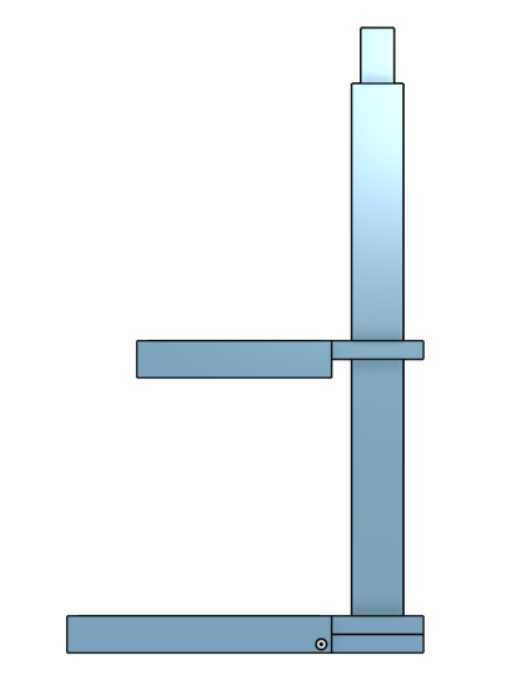
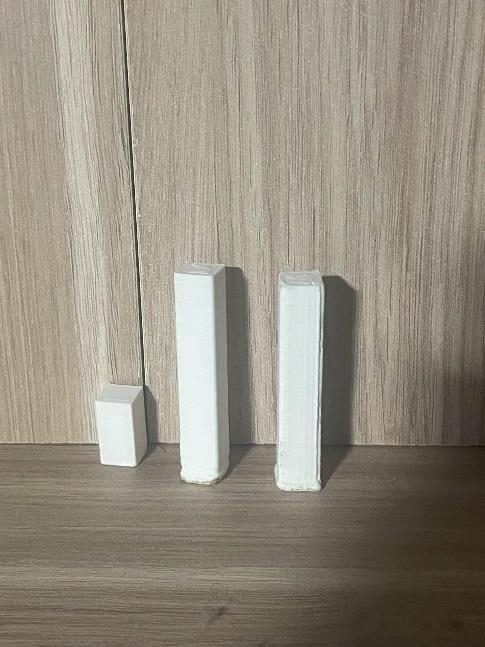

# Le Porte-savon

Un porte savon est un objet très utile il permet notamment de garder le savon au propre et créé un véritable espace de rangement. S’il est à étage il permet notamment de créer de l’espace en hauteur.

<!-- Image du porte savon full -->

## Problématique

Les lavabos d'appartements ne permettent pas toujours d'accueillir moultes objets notamment du à leur taille, c'est pourquoi l'optimisation de la place est primordiale. **Comment ranger les objets relatifs au lavabo tout en optimisant la place disponible ?**

## Solution

Le projet est le suivant : réaliser un porte savon à étages interchangeables imprimé entièrement en 3D qui permettrait de porter des éponges et des savons aussi bien pour la salle de bain que pour la cuisine, et ce totalement autoporté.

## Modélisation 3D

Le porte-savon à étages comporte 3 parties : une partie pour poser un grand savon ou 2 savons cubiques, une partie plus grande pour poser l’éponge et deux axes en liaison glissière. Ici le but est de pouvoir interchanger entre savon et éponge en fonction de ses choix, sachant que chaque support ne fait pas la même taille et est spécialisés par rapport à ce qu’il supporte.

L’axe du porte savon possède notamment 1 cm inutilisé à son sommet dans l’éventualité d’un agrandissement pour la création d’un 3eme espace de stockage. Les supports sont écartés entre eux de 7 cm par les parties entourant la base, permettant ainsi d’attraper les objets plus facilement

<!-- Tableau photos modélisation -->
 | 

## Difficultés rencontrées

Nous avons eu du mal à concevoir le mat supportant le "deuxième étage". Nous y sommes pris à plusieurs fois avant d'avoir la version finale car l'espace entre les supports et l'axe n'était pas assez important pour leur permettre de s'emboiter. Cette difficulté est en partie du au manque de précision des imprimantes 3D. Pour y remédier et éviter d'imprimer plusieurs fois le mat en entier, nous avons modélisé différents mats nous permettant d'essayer différents espaces entre les pièces et de trouver le bon.

<!-- Image petits mats -->

## Axes d'amélioration

Il serait intéressant d'ajouter des supports de l'autre coté du mat afin de rajouter de l'espace de stockage en plus d'équilibrer l'objet. Il est aussi possible en modifiant les supports, de décliner le projet en plusieurs supports différents.